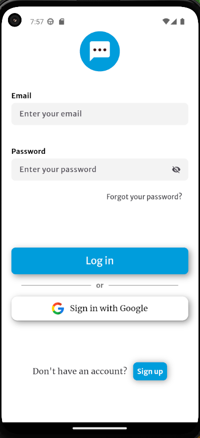

# Chat application

This project provides a chat application with Firebase authentication. Users can easily register, log in, explore user profiles, add contacts, and engage in seamless real-time chat conversations.

## Screenshots

Below are screenshots demonstrating various aspects of the application:

### Welcoming

---

### Register

---

### Login

---

### Explore users

---

### Add to contacts

---

### View contacts

---

### Chat with contact

---

### Send messages

---

### View your chats

---

### Logout

